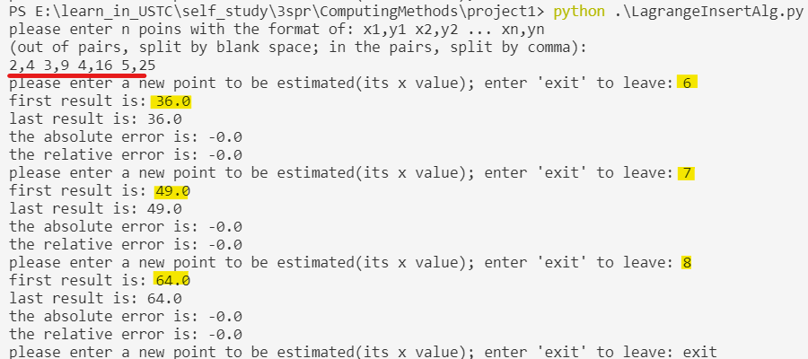
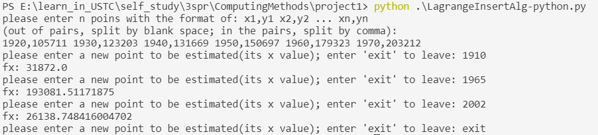
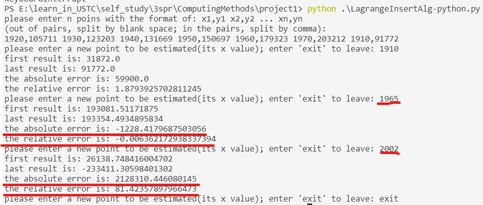
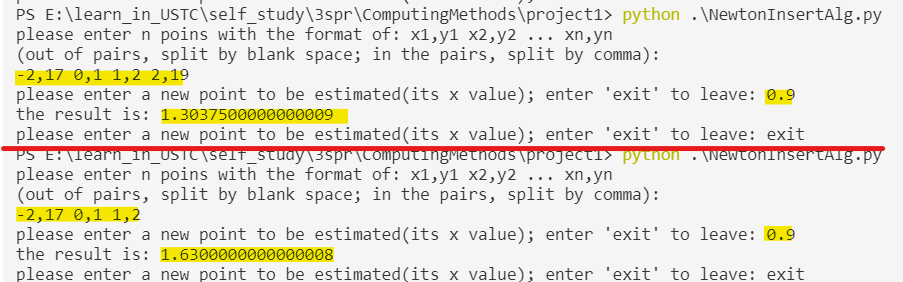
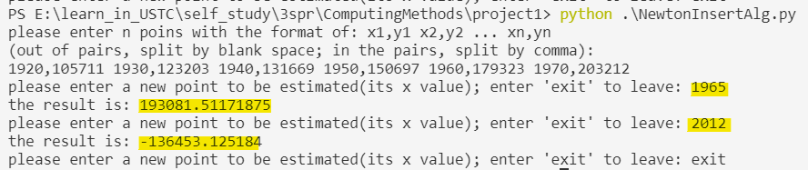

# project1
**姓名：** 徐怡
**学号：** PB19111672
## 程序2
### Lagrange插值多项式的数学形式
$$
\begin{equation*}
	\begin{split}
		&L_n(x) = \sum_{i=0}^{n} l_i(x)f(x_i) \\
		&l_i(x) = \prod_{0\leq j\leq n,j\neq i}\frac{x-x_j}{x_i-x_j}
	\end{split}
\end{equation*}
$$
### 构造Lagrange插值多项式的代码
1. 输入插值节点并做预处理
```python
# global variables
global x_list, y_list
global insert_length
# handle input
def preprocess_input_insert():
	print("please enter n poins with the format of: x1,y1 x2,y2 ... xn,yn")
	print("(out of pairs, split by blank space; in the pairs, split by comma):")
	raw_readline = input()
	# input preprocessing
	pairs = raw_readline.split(' ')
	global insert_length
	insert_length = len(pairs)
	global x_list, y_list
	x_list = []
	y_list = []
	for pair in pairs:
		pair = pair.split(',')
		x_list.append(int(pair[0]))
		y_list.append(int(pair[1]))
```
2. 用$L_n(x)$对待求的点进行估计
```python
# calculate unknown point
def handle_unkown_point(x_array, y_array, length, x):
	fx = 0
	for i in range(length):
		tmp = 1
		x_i = x_array[i]
		for j in range(i):
			x_j = x_array[j]
			tmp = tmp * (x - x_j) / (x_i - x_j)
		for j in range(i+1,length,1):
			x_j = x_array[j]
			tmp = tmp * (x - x_j) / (x_i - x_j)
		y_i = y_array[i]
		fx = fx + tmp*y_i
	return fx
```
3. 整体逻辑：对连续输入的待求节点进行处理
```python
if __name__=="__main__":
	preprocess_input_insert()
	while True: 
	x = input("please enter a new point to be estimated(its x value); enter 'exit' to leave: ")
	if x == "exit":
		break
	handle_unkown_point(x_list, y_list, insert_length, int(x))
```
### 程序的正确性验证

如上图所示，输入`2,4 3,9 4,16 5,25`构造二次函数的插值（实际输入了4个点对，因为最后一个点对用于误差的事后分析）。
则构造的插值函数$L_2(x)$对`6, 7, 8`都做了很好的估计：
$L_2(6) = 36$
$L_2(7) = 49$
$L_2(8) = 64$
所以可以认为代码大致上是比较正确的。
### 估计的结果

如上图，对于待求的点`1910`, `1965`, `2002`：
$L_5(1910)\approx31872$
$L_5(1965)\approx193082$
$L_5(2002)\approx 26139$
单位：千人
### 误差分析
因为原本给了n个点，后面又给了一个点`(1910,91772)`，适合使用事后分析的方法来做误差估计。
#### 事后分析的数学形式
$$
\begin{align*}
	&\textit{we have n+1 points in total: }\{x_1,x_2,...,x_n,x_{n+1}\}\\
	&\textit{use first n points: } \{x_1,x_2,...,x_n\}\textit{ to insert}\to L_n(x)\\
	&\textit{use last n points: } \{x_2,x_3,...,x_{n+1}\}\textit{ to insert}\to \widetilde{L}_n(x)\\
	&\textit{then the absolute error can be estimated by: }\\
	&\quad e = f(x)-L_n(x) \thickapprox \frac{x-x_1}{x_1-x_{n+1}}(L_n(x)-\widetilde{L}_n(x))\\
	&\textit{and the relative error can be estimated by: }\\
	&\quad e_r = \frac{absolute\ error}{approximate\ value}=\frac{e}{L_n(x)}
\end{align*}
$$
### 事后分析的代码
```python
# calculate using first n inserting points:
first_x = []
first_y = []
for i in range(0,insert_length-1,1):
	first_x.append(x_list[i])
	first_y.append(y_list[i])
first_result = handle_unkown_point(x_list, y_list, insert_length-1, x)
print("first result is: {}".format(first_result))

# calculate using last n inserting points:
last_x = []
last_y = []
for i in range(1,insert_length,1):
	last_x.append(x_list[i])
	last_y.append(y_list[i])
last_result = handle_unkown_point(last_x, last_y, insert_length-1, x)
print("last result is: {}".format(last_result))

# estimating the error
error = (x - x_list[0]) / (x_list[0] - x_list[insert_length-1])
error = error * (first_result - last_result)
print("the absolute error is: {}".format(error))
relative_error = error / first_result
print("the relative error is: {}".format(relative_error))
```
#### 误差分析的结果

由此可知：
* 插值得到的1965年的人口
	* 绝对误差约为：-1228（千人）
	* 相对误差约为：-0.006
* 插值得到的2002年的人口
	* 绝对误差约为：2128310（千人）
	* 相对误差约为：81.424
## 程序3
### Newton插值多项式的数学形式
$$
\begin{align*}
	&N_k(x) = N_{k-1}(x) + t_k(x)f[x_0,x_1,...,x_k]\\
	&t_0(x)\equiv 1,\ t_i(x)=(x-x_{i-1})t_{i-1}(x)=\prod_{k=0}^{i-1}(x-x_k),\ i=1,2,...,n\\
\end{align*}
$$
### Newton插值多项式的代码
1. 输入插值节点并做预处理：同`Lagrange插值`部分
2. 计算差商
```python
# create difference quotient table from n pairs of points
def difference_table(x_list, y_list, length):
	# initialize
	global g_list
	g_list = []
	for i in range(length):
		g_list.append(y_list[i])
	# calculate difference quotient for n points
	for k in range(1,length,1):
		for j in range(length-1,k-1,-1):
			g_list[j] = (g_list[j] - g_list[j-1]) / (x_list[j] - x_list[j-k])
```
3. 用$N_n(x)$对待求的点进行估计
```python
# estimate for unkown point
def handle_unkown_point(u, length):
	# initialize
	t = 1
	newton = g_list[0]
	for k in range(1,length,1):
		t = t * (u - x_list[k-1])
		newton = newton + t * g_list[k]
	return newton
```
4. 整体逻辑：对连续输入的待求点进行处理
```python
if __name__=="__main__":
	preprocess_input_insert()
	difference_table(x_list, y_list, insert_length)
	while True: 
		str_x = input("please enter a new point to be estimated(its x value); enter 'exit' to leave: ")
		if str_x == "exit":
			break
		x = float(str_x)
		result = handle_unkown_point(x, insert_length)
		print("the result is: {}".format(result))
 ```
### 程序的正确性验证

这是教材P31 例1.7，与书上的答案一致，说明程序大致是正确的。
### 估计的结果

如上图所示：
$N_5(1965)\approx193082$
$N_5(2012)\approx-136453$
单位：千人