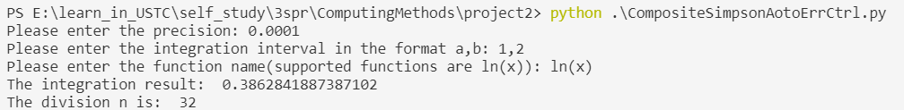

# project1
**姓名：** 徐怡
**学号：** PB19111672
## 程序8
### $T_n\ T_{2n}$的计算公式
$$
\begin{align*}
&T_n(f) = h_n[\frac{1}{2}f(a) + \sum_{i=1}^{n-1}f(x_i) + \frac{1}{2}f(b)] \\
&T_{2n}(f) = \frac{1}{2}[T_n(f) + H_n(f)] \\
&H_n(f) = h_n \sum_{i=0}^{n-1}f(x_{i+\frac{1}{2}})
\end{align*}
$$
每次迭代的时候，$n=n \times 2,\ h_n=h_n \div 2$.
### 代码思路
1. 输入与初始化
```python
import math
import sys

# preparation
eps = float(input("Please enter the precision: "))
line = input("Please enter the integration interval in the format a,b: ")
splited = line.split(",")
a = int(splited[0])
b = int(splited[1])
func = input("Please enter the function name(supported functions are ln(x)): ")

# initialization
n = 2
h_n = (b - a) / n
T_2 = math.log((a+b)/2) + math.log(a)/2 + math.log(b)/2
T_2 *= h_n
T_1 = T_2 + 100
global point_list
point_list = [a, (a+b)/2, b]
```
`import math`是为了调用`math.log()`函数，计算函数值；
用`point_list`列表来存储划分的点，后续迭代的时候会用到。
2. 计算 $H_n(f)$
```python
def H_n (h_n):
    # this function is to calculate the newly inserted point and add them to the point list
    result = 0
    global point_list
    length = len(point_list)
    bound = 2 * length - 2
    i = 0
    while i < bound:
        x_l = point_list[i]
		x_r = point_list[i+1]
		x_m = (x_l + x_r) / 2
		result += math.log(x_m)
		point_list.insert(i+1, x_m)
		i += 2
	result *= h_n
	return result
```
迭代计算 $H_n(f)$ 的时候，根据存储在`point_list`里的分点，构造新的分点（分点加密一倍，选取原来左分点 $x_l$ 和原来右分点 $x_r$ 的中点，记为 $x_m$ ，并插入`point_list`。
3. 迭代，参照教材P123的算法
```python
# iteration
while abs(T_1 - T_2) > eps:
	T_1 = T_2
	H = H_n(h_n)
	T_2 = (T_1 + H) / 2
	h_n /= 2
	n *= 2
```
### 正确性验证
使用$\int_{1}^{2}\ln xdx,\ \varepsilon=10^{-4}$ 进行验证：

程序输出为：`0.3862841887387102`；
$\int_{1}^{2}\ln xdx$ 的精确值为：`0.3862943611`；
此时程序将区间 $[1,2]$ 32等分。