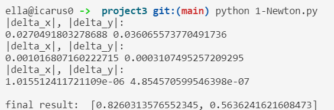

# project3
**姓名：** 徐怡
**学号：** PB19111672
## Q1 用Newton迭代法求解非线性方程组
### Basic idea
需要求解二阶方程组：
$$
\left\{
	\begin{array}{**lr**}
		f(x,y) = 0\\
		g(x,y) = 0
	\end{array}
\right.
$$
将$f(x,y),\ g(x,y)$在$(x_0,y_0)$处作二元Taylor展开，并取其线性部分：
$$
\left\{
	\begin{array}{**lr**}
		f(x,y) \approx f(x_0,y_0)+(x-x_0)\frac{\partial f(x_0,y_0)}{\partial x}+(y-y_0)\frac{\partial f(x_0,y_0)}{\partial y} = 0 \\
		g(x,y) \approx g(x_0,y_0)+(x-x_0)\frac{\partial g(x_0,y_0)}{\partial x}+(y-y_0)\frac{\partial g(x_0,y_0)}{\partial y} = 0
	\end{array}
\right.
$$
求解线性方程组：
$$
\left\{
	\begin{array}{**lr**}
		\frac{\partial f(x_n,y_n)}{\partial x}\Delta x_n+\frac{\partial f(x_n,y_n)}{\partial y}\Delta y_n = -f(x_n,y_n) \\
		\frac{\partial g(x_n,y_n)}{\partial x}\Delta x_n+\frac{\partial g(x_n,y_n)}{\partial y}\Delta y_n = -g(x_n,y_n) \\
	\end{array}
\right.
$$
矩阵形式：$Ax=b$
$$
A = \begin{pmatrix} f_x & f_y \\ g_x & g_y \end{pmatrix}, x = \begin{pmatrix} \Delta x \\ \Delta y \end{pmatrix}, b = \begin{pmatrix}-f\\-g \end{pmatrix}
$$
得到$(\Delta x, \Delta y)$，则$(x_{n+1},y_{n+1}) = (x_n,y_n)+(\Delta x,\Delta y),n=0,1,...$，迭代一直进行下去，直到$max(|\Delta x|,|\Delta y|) \leq \varepsilon$为止。
### Partial code
先根据题目给定的$f(x,y)$和$g(x,y)$，定义$f,g,f_x,f_y,g_x,g_y$的函数：
```python
# define several functions:
## original functions of f(x,y) and g(x,y)
def f(x, y):
    return x*x + y*y - 1
def g(x, y):
    return x*x*x - y
## partial differentiate functions of f on x and y
def df_x(x, y):
    return 2*x
def df_y(x, y):
    return 2*y
## partial differentiate functions of g on x and y
def dg_x(x, y):
    return 3*x*x
def dg_y(x, y):
    return -1
```
于是每次迭代的时候，根据上述定义的几个函数，得到矩阵$a$和$b$：
```python
a = [[df_x(xy_0[0], xy_0[1]), df_y(xy_0[0], xy_0[1])],
         [dg_x(xy_0[0], xy_0[1]), dg_y(xy_0[0], xy_0[1])]]
b = [-f(xy_0[0], xy_0[1]), -g(xy_0[0], xy_0[1])]
```
然后参考书P80的算法`Gauss Elimination`，求解二维的方程组：
```python
# define linear function solution: Gauss elimination method
def Gauss2D(a, b):
    # solve ax=b, a is 2x2 matrix and b is 2x1
    ## upper triangularize
    a[1][0] = a[1][0] / a[0][0]
    a[1][1] = a[1][1] - a[1][0] * a[0][1]
    b[1] = b[1] - a[1][0] * b[0]
    ## back substitution
    b[1] = b[1] / a[1][1]
    b[0] = b[0] - a[0][1] * b[1]
    b[0] = b[0] / a[0][0]
    return b
```
然后进行迭代即可。
### Running result

上图显示了求解过程，最终得到的误差小于$10^{-5}$，结果为：
```bash
x = 0.8260313576552345, y = 0.5636241621608473
```

---
## Q2 用二阶Runge-Kutta公式求解常微分方程组初值问题
### Basic idea
二阶的Runge-Kutta公式：
$$
\left\{
	\begin{array}{**lr**}
		y_{n+1}=y_n+h(c_1k_1+c_2k_2) \\
		k_1 = f(x_n,y_n) \\
		k_2 = f(x_n+ah,y_n+bhk_1)
	\end{array}
	
\right.
$$
选择书P148的形式，即$c_1 = c_2 = \frac{1}{2}, a = b = 1$：
$$
\left\{
	\begin{array}{**lr**}
		y_{n+1}=y_n+\frac{h}{2}(k_1+k_2) \\
		k_1 = f(x_n,y_n) \\
		k_2 = f(x_n+h,y_n+hk_1)
	\end{array}
\right.
$$

### Partial code
先根据题目定义$f(x,y)$：
```python
import math
  
# dy/dx = f(x,y)
def f(x, y):
    return y * math.sin(x * math.pi)
```
然后进行迭代，并输出每步迭代的结果：
```python
def rungeKutta(x0, y0, x, n):
# interval [x0, x]
# partition the interval into n smaller intervals
# y(x0) = y0
# should solve y1,...,yn in [x0, x]
    h = (x - x0) / n # length of the smaller interval
    for i in range(1, n + 1):
        k1 = f(x0, y0)
        k2 = f(x0 + h, y0 + h * k1)
        y = y0 + 0.5 * h * (k1 + k2)
        print("k = {}, yk = {}".format(i, y))
        y0 = y
```
### Running result

上图显示了求解过程，输入的区间为$(0,5)$，将该区间分成了10个小区间来近似。

---
## Q3 用改进的Euler公式求解常微分方程组初值问题
### Basic idea
用题中给出的改进后的Euler公式进行迭代：
$$
\begin{pmatrix}\bar y_{n+1} \\ \bar z_{n+1}\end{pmatrix} = \begin{pmatrix}y_n \\ z_n\end{pmatrix} + h\begin{pmatrix}f(x_n,y_n,z_n) \\ g(x_n,y_n,z_n)\end{pmatrix}
$$
$$
\begin{pmatrix}y_{n+1} \\ z_{n+1}\end{pmatrix} = \begin{pmatrix}y_n \\ z_n\end{pmatrix} + \frac{h}{2}[\begin{pmatrix}f(x_n,y_n,z_n) \\ g(x_n,y_n,z_n)\end{pmatrix}+\begin{pmatrix}f(\bar x_{n+1},\bar y_{n+1},\bar z_{n+1}) \\ g(\bar x_{n+1},\bar y_{n+1},\bar z_{n+1})\end{pmatrix}]
$$
### Partial code
先根据题目定义$f(u,v),\ g(u,v)$：
```python
# define f and g: du/dt = f, dv/dt = g
def f(u, v):
    return 0.09*u*(1-u/20) - 0.45*u*v
def g(u, v):
    return 0.06*v*(1-v/15) - 0.001*u*v
```
然后进行迭代，并输出每步迭代的结果：
```python
# optimized euler method, according to the problem
def euler(x0, y0, z0, x, N):
# interval [x0, x]
# partition the interval into N smaller intervals
# y0 = y(x0), z0 = z(x0)
# should solve (y1,z1),...,(yN,zN) in [x0, x]
    h = (x - x0) / N # length of the smaller interval
    for i in range(1, N + 1) :
        delta_y1 = y0 + h * f(y0, z0)
        delta_z1 = z0 + h * g(y0, z0)
        y1 = y0 + (h/2) * (f(y0, z0) + f(delta_y1, delta_z1))
        z1 = z0 + (h/2) * (g(y0, z0) + g(delta_y1, delta_z1))
        print("k = {}, yk = {}, zk = {}".format(i, y1, z1))
        y0 = y1
        z0 = z1
```
### Running result

上图显示了求解过程，输入的区间为$(0,5)$，将该区间分成了10个小区间来近似。

---
## Appendix: source code
### Q1 Newton
```python
# define several functions:
## original functions of f(x,y) and g(x,y)
def f(x, y):
    return x*x + y*y - 1
def g(x, y):
    return x*x*x - y
## partial differentiate functions of f on x and y
def df_x(x, y):
    return 2*x
def df_y(x, y):
    return 2*y
## partial differentiate functions of g on x and y
def dg_x(x, y):
    return 3*x*x
def dg_y(x, y):
    return -1
  
# define linear function solution: Gauss elimination method
def Gauss2D(a, b):
    # solve ax=b, a is 2x2 matrix and b is 2x1
    ## upper triangularize
    a[1][0] = a[1][0] / a[0][0]
    a[1][1] = a[1][1] - a[1][0] * a[0][1]
    b[1] = b[1] - a[1][0] * b[0]
    ## back substitution
    b[1] = b[1] / a[1][1]
    b[0] = b[0] - a[0][1] * b[1]
    b[0] = b[0] / a[0][0]
    return b
  
# solve non-linear functions
xy_0 = [1, 1]
xy_1 = [0.8, 0.6] # initial value
d_xy = [1, 1]
while max(abs(d_xy[0]), abs(d_xy[1])) > 1e-5:
    xy_0 = xy_1
    a = [[df_x(xy_0[0], xy_0[1]), df_y(xy_0[0], xy_0[1])],
         [dg_x(xy_0[0], xy_0[1]), dg_y(xy_0[0], xy_0[1])]]
    b = [-f(xy_0[0], xy_0[1]), -g(xy_0[0], xy_0[1])]
    d_xy = Gauss2D(a, b)
    xy_1[0] = xy_0[0] + d_xy[0]
    xy_1[1] = xy_0[1] + d_xy[1]
    print("|delta_x|, |delta_y|: ")
    print(abs(d_xy[0]), abs(d_xy[1]))
print("\nfinal result: ", xy_1)
```
### Q2 Runge-Kutta
```python
import math
  
# dy/dx = f(x,y)
def f(x, y):
    return y * math.sin(x * math.pi)
  
def rungeKutta(x0, y0, x, n):
# interval [x0, x]
# partition the interval into n smaller intervals
# y(x0) = y0
# should solve y1,...,yn in [x0, x]
    h = (x - x0) / n # length of the smaller interval
    for i in range(1, n + 1):
        k1 = f(x0, y0)
        k2 = f(x0 + h, y0 + h * k1)
        y = y0 + 0.5 * h * (k1 + k2)
        print("k = {}, yk = {}".format(i, y))
        y0 = y
  
# handle input and output
print("the start of interval is 0, please enter the")
print("end of interval(b) and number of partitions(n)")
print("in the format b,n :")
str = input()
splited_str = str.split(',')
b = float(splited_str[0])
n = int(splited_str[1])
rungeKutta(0, 1, b, n)
```
### Q3 Optimised Euler
```python
# define f and g: du/dt = f, dv/dt = g
def f(u, v):
    return 0.09*u*(1-u/20) - 0.45*u*v
def g(u, v):
    return 0.06*v*(1-v/15) - 0.001*u*v
  
# optimized euler method, according to the problem
def euler(x0, y0, z0, x, N):
# interval [x0, x]
# partition the interval into N smaller intervals
# y0 = y(x0), z0 = z(x0)
# should solve (y1,z1),...,(yN,zN) in [x0, x]
    h = (x - x0) / N # length of the smaller interval
    for i in range(1, N + 1) :
        delta_y1 = y0 + h * f(y0, z0)
        delta_z1 = z0 + h * g(y0, z0)
        y1 = y0 + (h/2) * (f(y0, z0) + f(delta_y1, delta_z1))
        z1 = z0 + (h/2) * (g(y0, z0) + g(delta_y1, delta_z1))
        print("k = {}, yk = {}, zk = {}".format(i, y1, z1))
        y0 = y1
        z0 = z1
  
# handle input and output
print("the start of interval is 0, please enter the")
print("end of interval(b) and number of partitions(N)")
print("in the format b,N :")
str = input()
splited_str = str.split(',')
b = float(splited_str[0])
N = int(splited_str[1])
euler(0, 1.6, 1.2, b, N)
```